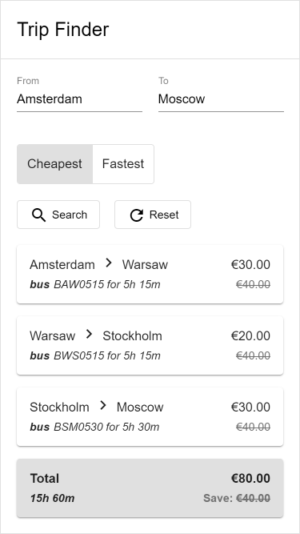

# Trip Finder
A small app that uses graphs and [Dijkstra’s algorithm](https://hackernoon.com/how-to-implement-dijkstras-algorithm-in-javascript-abdfd1702d04) to implement a simple and quick search of the cheapest or fastest path between two destinations where multiple transportation modes are available, such as car, bus or train.

## Live demo
https://trip-finder-heroku.herokuapp.com

## Getting started
- `npm i` installs the dependencies (should be run first)
- `ng serve` runs a dev server (navigate to `http://localhost:4200/`)
- `ng build` builds the project to `dist/` directory (use `--prod` for a production build)
- `ng test` runs unit tests
- `ng e2e` runs end-to-end tests
